[](#readme)

<p align="center">
  
  
  
  
  
  
</p>

<p align="center">
<strong>A hands-on detection engineering exercise: a real, YARA-confirmed AgentTesla sample was detonated in an interactive sandbox, its persistence and C2 behavior was documented from raw telemetry, translated into two Sigma rules, and each rule was independently validated by reproducing the behavior on a live AWS Windows host and hunting the resulting Sysmon logs with Chainsaw.</strong>
</p>

<p align="center">
<a href="#-lab-at-a-glance">Lab at a Glance</a> ·
<a href="#-environment-setup">Environment</a> ·
<a href="#-malware-behavioral-analysis">Malware Analysis</a> ·
<a href="#-indicators-of-compromise-ioc-table">IOCs</a> ·
<a href="#-sigma-detection-rules">Sigma Rules</a> ·
<a href="#-validation--proof-of-detection">Validation</a> ·
<a href="#-honest-scope--limitations">Scope & Limitations</a> ·
<a href="#-repository-map">Repo Map</a>
</p>

---

## 🎯 Lab at a Glance

This project answers one question a real SOC / detection engineer has to answer constantly: **given a known malware sample, can we turn its observed behavior into a detection rule that actually fires on real endpoint telemetry — not just "looks right" on paper?**

| | |
|---|---|
| **Malware family** | Agent Tesla (.NET infostealer / keylogger) |
| **Sample verdict** | Malicious activity — YARA confirmed |
| **SHA256** | `708e198608b5b463224c3fb77fcf708b845d0c7b5dbc6e9cab9e185c489be089` |
| **Sandbox** | ANY.RUN Interactive Sandbox (public submission, Windows 10 x64) |
| **Persistence technique observed** | Scheduled Task creation (`schtasks.exe`) from a process running out of `%TEMP%`, disguised under an `Updates\` folder |
| **C2 channel observed** | SMTP-based exfiltration to `godforeu.com` (`34.41.139.193:587`) |
| **MITRE ATT&CK** | `T1053.005` Scheduled Task, `T1071.003` Application Layer Protocol (Mail) |
| **Detection rules produced** | 2 Sigma rules — one TTP-based (persistence), one IOC-based (C2) |
| **Validation method** | Behavior reproduced on a real AWS Windows EC2 host with Sysmon → exported to `.evtx` → hunted with **Chainsaw** |
| **Result** | ✅ Both rules fired correctly against real Sysmon telemetry |
| **Infra cost** | $0 — entirely built on AWS Free Tier (`t3.micro`) |

---

## 🧭 How the Exercise Unfolded

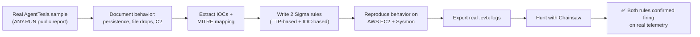

The entire exercise deliberately mirrors a real detection engineering workflow: **detonate → observe → extract → write → validate** — not just "write a rule and assume it works."

---

## 🖥️ Environment Setup

Everything was built from scratch on **AWS Free Tier** — a single `t3.micro` Windows Server 2022 instance with **Sysmon** (SwiftOnSecurity configuration) installed as the telemetry source, exactly the way a production endpoint would be instrumented.

<p align="center">
  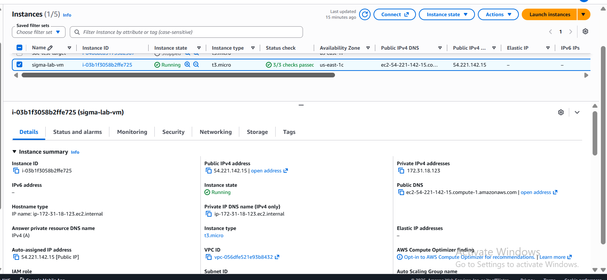
  <br/><em>Free-tier-eligible Windows EC2 instance, status checks passed.</em>
</p>

<p align="center">
  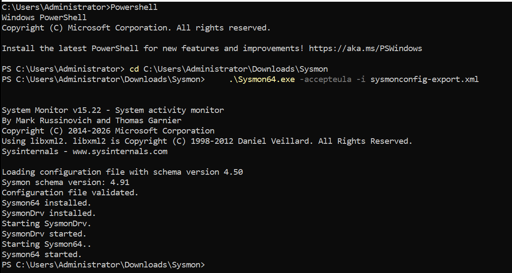
  <br/><em>Sysmon installed with the SwiftOnSecurity community configuration.</em>
</p>

<p align="center">
  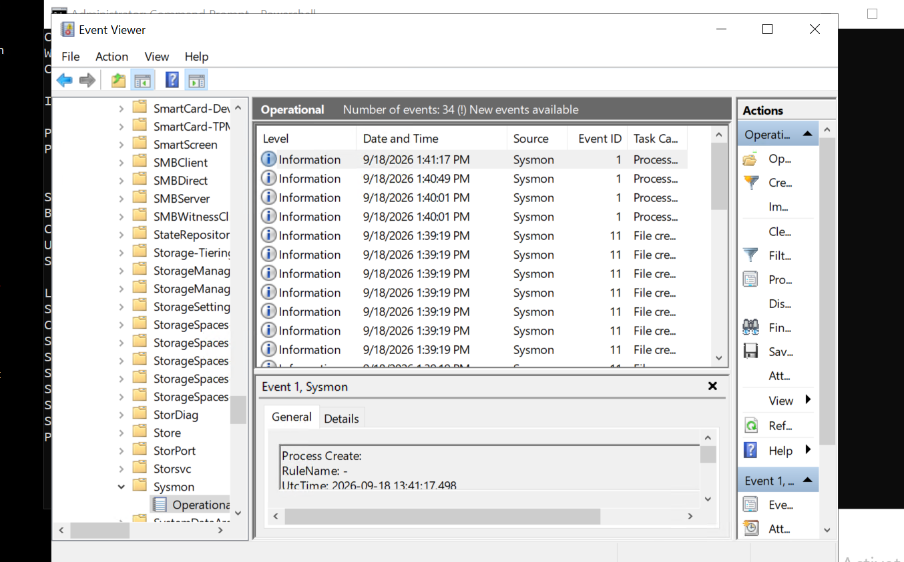
  <br/><em>Sysmon confirmed actively logging Process Create (ID 1) and File Create (ID 11) events before any malware behavior was introduced — a clean baseline.</em>
</p>

---

## 🦠 Malware Behavioral Analysis

Rather than handling a live malware binary directly, this lab uses **ANY.RUN's public sandbox submissions** — a legitimate, standard practice in the industry for studying already-detonated, verdict-confirmed samples without introducing unnecessary risk.

**Sample selected:** an AgentTesla dropper delivered inside a password-protected `.zip` (a common AV-evasion trick), tagged `agenttesla`, `stealer`, `auto-sch-xml`, `ultravnc`, `rmm-tool`, `smtp`.

<p align="center">
  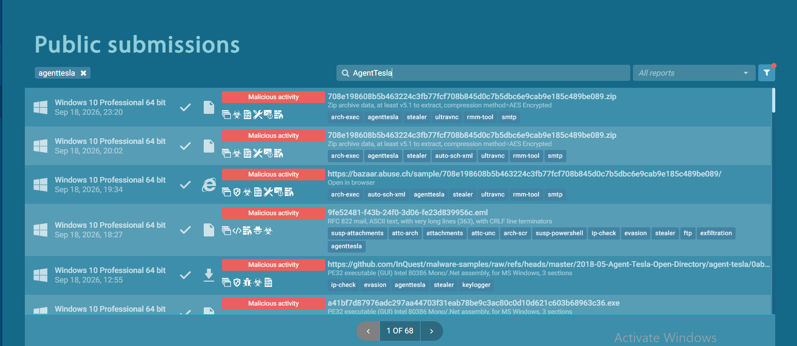
  <br/><em>Public submission search — filtering for confirmed "Malicious activity" verdicts.</em>
</p>

<p align="center">
  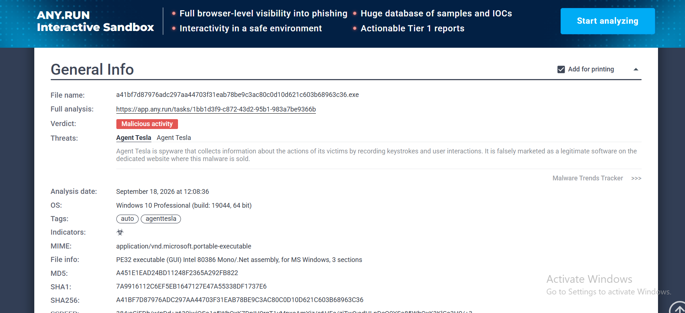
  <br/><em>Confirmed sample identity — SHA256, MD5, and Agent Tesla family attribution.</em>
</p>

### Persistence — Scheduled Task, Not a Registry Key

The first sample attempted showed sandbox-evasion behavior (reconnaissance only, no full detonation) — a real, documented finding in its own right. Pivoting to a richer, fully-detonated report revealed the actual persistence mechanism:

<p align="center">
  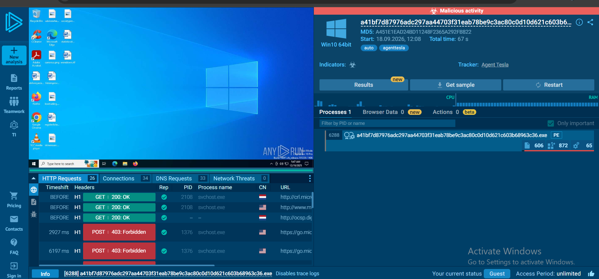
  <br/><em>Process tree: the malware binary (running from %TEMP%) spawns <code>schtasks.exe</code> directly.</em>
</p>

<p align="center">
  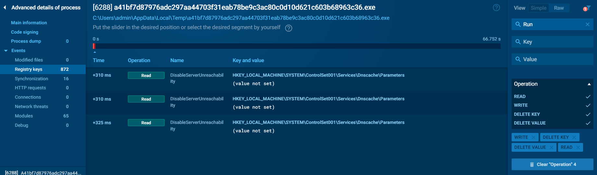
  <br/><em>The exact command: <code>schtasks /Create /TN "Updates\neHneiobyhcrJJ" /XML "...\tmp77E5.tmp"</code> — a scheduled task disguised under an "Updates" folder with a randomized name.</em>
</p>

### Command & Control — SMTP-Based Exfiltration

<p align="center">
  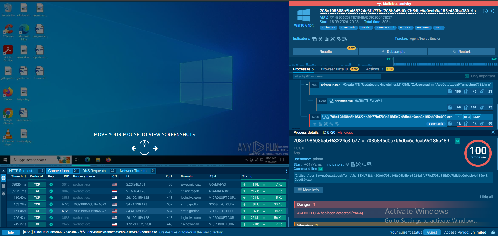
  <br/><em>Outbound connections to <code>smtp.godfor...</code> on port 587 — SMTP abused as a covert exfiltration channel.</em>
</p>

<p align="center">
  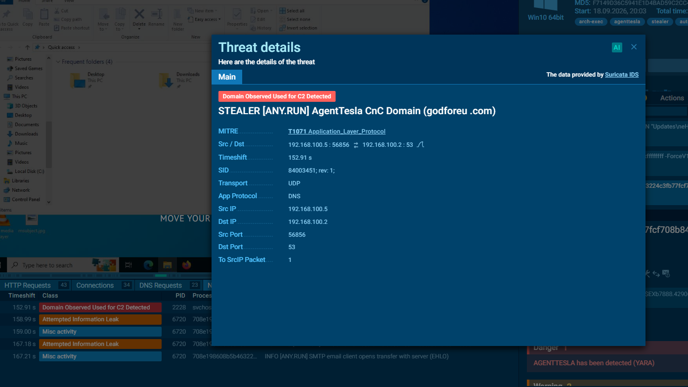
  <br/><em>Suricata IDS (via ANY.RUN) independently confirms <code>godforeu.com</code> as a known AgentTesla C2 domain — MITRE T1071 Application Layer Protocol.</em>
</p>

> **Threat intel note:** at the time of this analysis, `godforeu.com` still actively resolved to a live IP (`34.41.139.193`) — the C2 infrastructure had not been sinkholed or taken down.

---

## 🔑 Indicators of Compromise (IOC Table)

| Type | Value |
|---|---|
| SHA256 | `708e198608b5b463224c3fb77fcf708b845d0c7b5dbc6e9cab9e185c489be089` |
| MD5 | `F7149D36C5941E1D4BAD59C2CC451D37` |
| Malware family | Agent Tesla (Stealer / Keylogger) |
| Persistence — task name | `Updates\neHneiobyhcrJJ` |
| Persistence — creating process | `schtasks.exe`, parent running from `%TEMP%` |
| C2 domain | `godforeu.com` |
| C2 IP | `34.41.139.193` |
| C2 port / protocol | `587` (SMTP, disguised as legitimate mail traffic) |
| MITRE ATT&CK | `T1053.005` (Scheduled Task), `T1071.003` (App Layer Protocol — Mail) |

<p align="center">
  
  <br/><em>C2 domain/IP as confirmed by the sandbox's built-in threat intelligence feed.</em>
</p>

---

## 🛡️ Sigma Detection Rules

Two rules were written, **deliberately of two different kinds** — this mirrors how real detection teams actually operate, not a single one-size-fits-all rule:

| Rule | Type | Why |
|---|---|---|
| [`persistence_scheduled_task.yml`](sigma-rules/persistence_scheduled_task.yml) | **TTP-based** (behavior/technique) | Detects *any* process — regardless of malware family — that creates a scheduled task while itself running from `%TEMP%`/`%AppData%`. Durable: still catches tomorrow's unknown variant using the same trick. |
| [`c2_network_callback.yml`](sigma-rules/c2_network_callback.yml) | **IOC-based** (indicator) | Detects DNS/network activity to the exact confirmed C2 domain/IP. Fast and precise, but "expires" the moment the attacker rotates infrastructure. |

```yaml
# persistence_scheduled_task.yml (excerpt)
logsource:
  category: process_creation
  product: windows
detection:
  selection_schtasks:
    Image|endswith: '\schtasks.exe'
    CommandLine|contains: '/Create'
  selection_parent_temp:
    ParentImage|contains:
      - '\AppData\Local\Temp\'
      - '\AppData\Roaming\'
  condition: selection_schtasks and selection_parent_temp
level: high
```

Both rules are intentionally marked `status: experimental` — see [Scope & Limitations](#-honest-scope--limitations) below for why.

---

## ✅ Validation — Proof of Detection

Writing a Sigma rule proves nothing on its own. To actually validate it, the exact observed technique was **safely reproduced** on the AWS lab VM (not by re-running the malware, but by recreating the specific anomalous pattern — a Temp-located binary spawning `schtasks.exe` with the identical task name), captured in real Sysmon telemetry, and hunted using **[Chainsaw](https://github.com/WithSecureOpenSource/chainsaw)**.

### Persistence Rule Validation

<p align="center">
  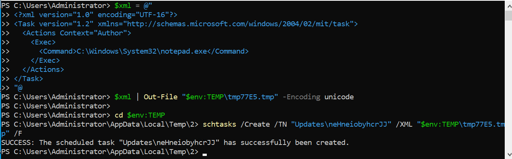
  <br/><em>Reproducing the exact command pattern on the AWS lab VM.</em>
</p>

<p align="center">
  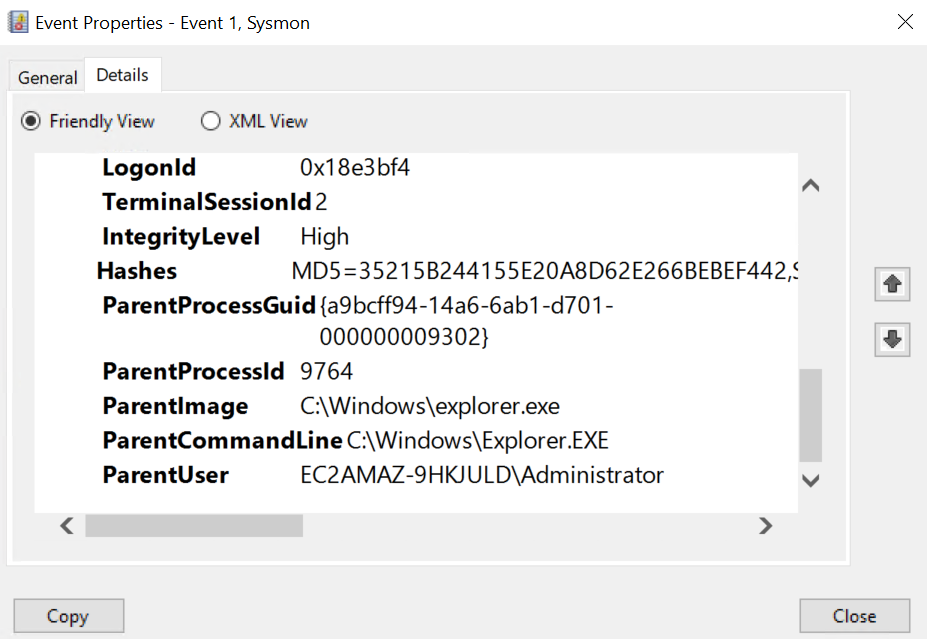
  <br/><em>Confirming true anomaly fidelity: <code>ParentImage</code> genuinely resolves to a Temp-folder binary, not a trusted system parent — matching the real malware's pattern exactly.</em>
</p>

<p align="center">
  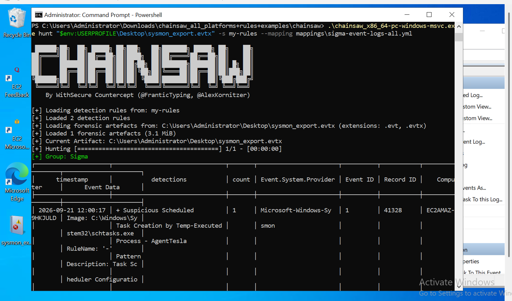
  <br/><em><strong>Chainsaw confirms the hit:</strong> "Suspicious Scheduled Task Creation by Temp-Executed Process - AgentTesla Pattern" fires on Event ID 1, at the exact timestamp of the simulated activity.</em>
</p>

### C2 Rule Validation

<p align="center">
  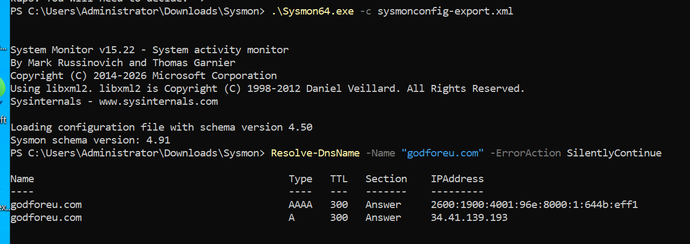
  <br/><em>A safe DNS-only lookup (no connection made) confirms <code>godforeu.com</code> still resolves to the same C2 IP found in the sandbox report.</em>
</p>

<p align="center">
  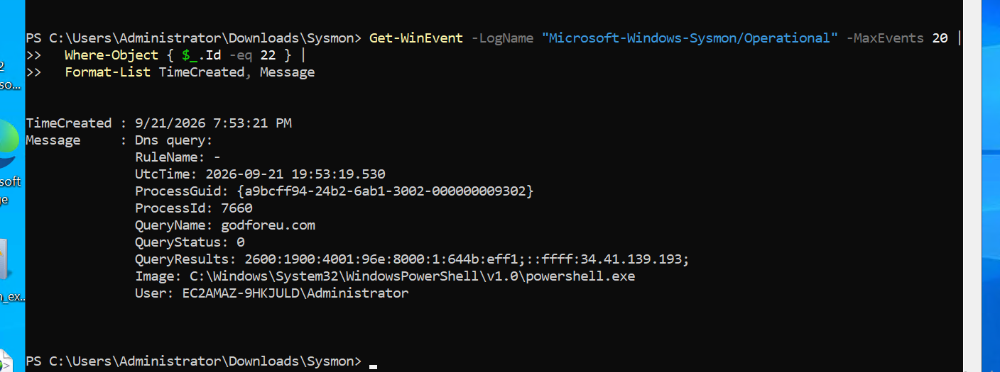
  <br/><em>Sysmon Event ID 22 (DNS Query) capturing the lookup with matching QueryResults.</em>
</p>

<p align="center">
  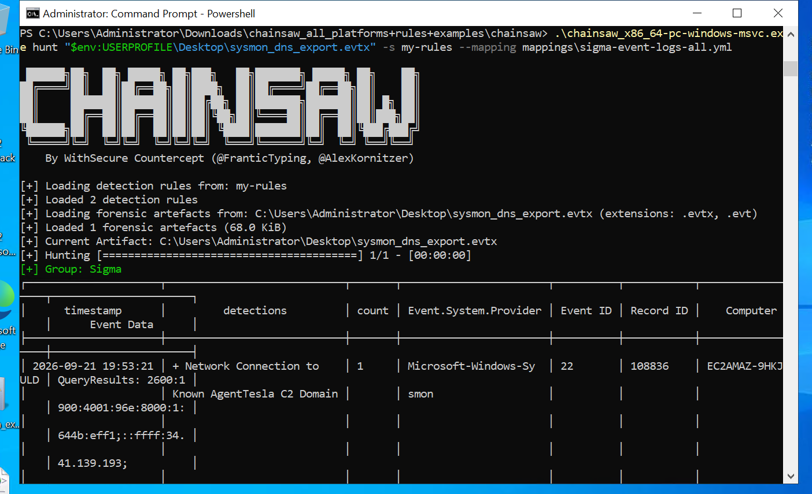
  <br/><em><strong>Chainsaw confirms the second hit:</strong> "Network Connection to Known AgentTesla C2 Domain" fires on Event ID 22, matching the confirmed C2 domain.</em>
</p>

---

## 📋 Honest Scope & Limitations

Detection engineering claims are only useful if they're accurately scoped. This lab is **real, validated, and methodologically sound** — but here's exactly what it does and doesn't prove:

| What was done | What this proves |
|---|---|
| ✅ Analyzed a real, YARA-confirmed, live-detonated AgentTesla sample | Genuine malware behavior, not a synthetic example |
| ✅ Extracted IOCs and MITRE mapping directly from raw sandbox telemetry | Findings are evidence-based, not assumed |
| ✅ Reproduced the *exact* anomalous pattern (Temp-located binary → `schtasks.exe`) on a real Windows host | The rule's logic correctly matches the real technique's telemetry signature |
| ✅ Validated both rules with Chainsaw against real `.evtx` Sysmon logs | The rules are not theoretical — they demonstrably fire |
| ⚠️ The malware binary itself was **not** detonated on the AWS lab VM — its specific persistence artifact was safely simulated instead | This proves the rule catches the **technique**, not that it caught this exact binary executing live |
| ⚠️ Tested against a single sample / single environment | A production rollout would need broader false-positive baselining across more samples and real production traffic before promoting `status: experimental` → `status: stable` |

This is why both Sigma rules are marked `status: experimental` — an honest, correct classification for a single-sample research exercise, not a production-hardened detection.

---

## 🗂️ Repository Map

| Path | Purpose |
|---|---|
| [`README.md`](README.md) | This file — full narrative, evidence, and findings |
| [`sigma-rules/`](sigma-rules/) | The two validated Sigma detection rules |
| [`screenshots/01-environment-setup/`](screenshots/01-environment-setup/) | AWS + Sysmon lab environment evidence |
| [`screenshots/02-malware-analysis/`](screenshots/02-malware-analysis/) | AgentTesla sandbox behavioral analysis evidence |
| [`screenshots/03-iocs/`](screenshots/03-iocs/) | Indicator extraction evidence |
| [`screenshots/05-validation/`](screenshots/05-validation/) | Chainsaw proof-of-detection evidence |
| [`docs/IOC-TABLE.md`](docs/IOC-TABLE.md) | Standalone IOC reference sheet |

---

## 📌 Completion Record

| Stage | Status |
|---|---|
| AWS Free Tier environment + Sysmon | ✅ Complete |
| Real malware sample identified & analyzed | ✅ Complete (AgentTesla, YARA-confirmed) |
| Persistence mechanism documented | ✅ Complete (Scheduled Task, T1053.005) |
| C2 mechanism documented | ✅ Complete (SMTP exfil, T1071.003) |
| IOC extraction | ✅ Complete |
| Sigma rule — persistence (TTP-based) | ✅ Written & validated |
| Sigma rule — C2 (IOC-based) | ✅ Written & validated |
| Chainsaw validation — persistence rule | ✅ Confirmed firing on real Sysmon telemetry |
| Chainsaw validation — C2 rule | ✅ Confirmed firing on real Sysmon telemetry |
| Scope/limitations documented | ✅ Complete |

---

<p align="center">
<sub>Built as a hands-on detection engineering exercise on AWS Free Tier. Sample analyzed via <a href="https://any.run">ANY.RUN</a> public sandbox submissions. Validated with <a href="https://github.com/WithSecureOpenSource/chainsaw">Chainsaw</a> by WithSecure.</sub>
</p>

[](#readme)
